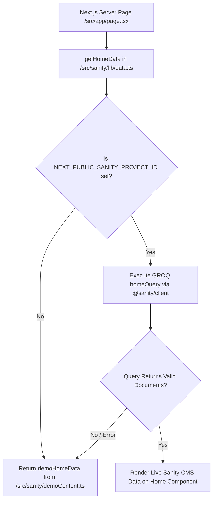

# Project Technical Documentation & Sanity CMS Integration Guide

This document provides a comprehensive overview of **what has been built so far** in the Vinskape home-page prototype, followed by a step-by-step operational guide on **what has to be done to connect live Sanity CMS**.

---

## Part 1: What Has Been Done (Current Implementation)

### 1. Technology Stack & Core Architecture

- **Framework**: [Next.js 15](https://nextjs.org/) (App Router, Server Components)
- **UI Library**: React 19 & TypeScript
- **Styling**: Styled-Components (`styled-components`) + Custom CSS Modules / Globals (`src/app/globals.css`)
- **Content Management**: [Sanity CMS](https://www.sanity.io/) (`sanity` v3.79.0, `@sanity/client` v7.6.0, `@sanity/image-url` v1.1.0)
- **Dev Tools**: ESLint 9, TypeScript 5, Sanity Studio CLI (`sanity dev`)

### 2. Project Directory Structure

```
vinskape-demo/
├── .env.local.example       # Blueprint for required environment variables
├── next.config.ts           # Next.js configuration
├── package.json             # Dependencies and scripts (dev, studio, build)
├── sanity.config.ts         # Sanity Studio configuration (defines schemas, plugins)
├── src/
│   ├── app/
│   │   ├── globals.css      # Global styles, typography, color tokens
│   │   ├── layout.tsx       # Main HTML root layout & fonts
│   │   └── page.tsx         # Next.js server page fetching Sanity home data
│   ├── components/
│   │   ├── home/
│   │   │   ├── Hero.tsx     # Hero carousel component (autoplay, dynamic slides)
│   │   │   └── Home.tsx     # Main home layout rendering sections (intro, services, projects, etc.)
│   │   └── layout/
│   │       ├── Navigation.tsx # Dynamic hierarchical navigation bar
│   │       └── WhatsApp.tsx   # Dynamic floating WhatsApp button
│   └── sanity/
│       ├── demoContent.ts   # Complete fallback dataset for offline/unconfigured mode
│       ├── types.ts         # TypeScript definitions for CMS objects
│       ├── lib/
│       │   ├── client.ts    # Sanity client initialization & config validator
│       │   └── data.ts      # Fail-safe data loader (Sanity query with fallback)
│       ├── queries/
│       │   └── home.ts      # GROQ query for home page dataset
│       └── schemas/
│           └── index.ts     # Complete collection of 11 Sanity schema definitions
```

---

### 3. Sanity Content Schemas Implemented

The content model is fully defined in [`src/sanity/schemas/index.ts`](file:///c:/Users/DELL/Documents/Codex/2026-08-22/files-pasted-by-the-user-vinskape/outputs/vinskape-demo/src/sanity/schemas/index.ts) with 11 specialized document types:

1. **`siteSettings`**: Global brand info (name, tagline, logo image), contact details (phone, email, WhatsApp message, address, business hours), hero slider autoplay interval, default SEO settings.
2. **`navigationItem`**: Hierarchical multi-level navigation menu with parent-child references, order sorting, visibility toggles, and featured flags.
3. **`heroSlide`**: Banner slides featuring title, eyebrow, heading, body description, hotspot-enabled background image, primary & secondary CTAs, and active status.
4. **`homeIntroduction`**: Intro section with statistics array (value + label), image, eyebrow, heading, body, and CTA.
5. **`service`**: Service offerings categorized by Residential, Commercial, or Industrial, complete with sub-service list items, hotspot image, and action button.
6. **`project`**: Featured portfolio projects with title, slug, project type, category, location, cover image, image gallery, status (`Ongoing`/`Completed`), and completion date.
7. **`portfolioCategory`**: Portfolio filter categories with slug, cover image, and description.
8. **`testimonial`**: Client reviews with client image, rating (1-5 stars), location, quote, and reference to specific projects.
9. **`dealer`**: Authorized dealers/partners with logo, description, external URL, and category.
10. **`homeSectionSettings`**: CMS controls for toggling visibility and custom headings for individual home sections.
11. **`seoSettings`**: Per-page SEO metadata including title, meta description, OpenGraph image, keywords, and canonical URL.

---

### 4. Fail-Safe Hybrid Data Pipeline

To ensure the website runs instantly without requiring an immediate CMS connection, a **hybrid data strategy** was implemented:

- **Config Check**: [`src/sanity/lib/client.ts`](file:///c:/Users/DELL/Documents/Codex/2026-08-22/files-pasted-by-the-user-vinskape/outputs/vinskape-demo/src/sanity/lib/client.ts) verifies if `NEXT_PUBLIC_SANITY_PROJECT_ID` is present.
- **Fail-Safe Fetching**: [`src/sanity/lib/data.ts`](file:///c:/Users/DELL/Documents/Codex/2026-08-22/files-pasted-by-the-user-vinskape/outputs/vinskape-demo/src/sanity/lib/data.ts) executes the GROQ query in [`src/sanity/queries/home.ts`](file:///c:/Users/DELL/Documents/Codex/2026-08-22/files-pasted-by-the-user-vinskape/outputs/vinskape-demo/src/sanity/queries/home.ts).
- **Graceful Fallback**: If Sanity credentials are missing, network requests fail, or no live documents exist, the app gracefully returns [`src/sanity/demoContent.ts`](file:///c:/Users/DELL/Documents/Codex/2026-08-22/files-pasted-by-the-user-vinskape/outputs/vinskape-demo/src/sanity/demoContent.ts).

---

## Part 2: What Has To Be Done (Connecting to Live Sanity CMS)

Follow these steps to connect your project to a real, live Sanity Content Lake:

### Step 1: Create a Sanity Project & Get Credentials

1. Go to **[sanity.io](https://www.sanity.io/)** and sign up / log in to your account.
2. Open your terminal or visit the **[Sanity Manage Dashboard](https://manage.sanity.io/)**.
3. Create a new project:
   - **Via CLI**: Run `npx sanity@latest init` in a separate directory or follow the prompts.
   - **Via Dashboard**: Click **"Create new project"**, give it a name (e.g., `vinskape`), and select the default dataset name: `production`.
4. Copy your **Project ID** (a string of alphanumeric characters, e.g., `abc123xy`).

---

### Step 2: Set Up Local Environment Variables

1. In the project root, duplicate `.env.local.example` to create `.env.local`:
   ```bash
   cp .env.local.example .env.local
   ```
2. Open `.env.local` and enter your Sanity Project ID and Dataset:
   ```env
   NEXT_PUBLIC_SANITY_PROJECT_ID=your_actual_project_id_here
   NEXT_PUBLIC_SANITY_DATASET=production
   NEXT_PUBLIC_SANITY_API_VERSION=2025-01-01
   NEXT_PUBLIC_SANITY_STUDIO_URL=/studio
   ```

---

### Step 3: Run Sanity Studio & Add Content

1. Start the Sanity Studio local development server:
   ```bash
   npm run studio
   ```
2. Open your browser and navigate to **`http://localhost:3333`** (or the URL output in your terminal).
3. Log in with your Sanity credentials when prompted.
4. Populate initial content in Sanity Studio:
   - **Site Settings**: Add your brand name, logo, contact phone/WhatsApp/email, and default SEO.
   - **Navigation**: Create menu items (e.g., Home, Services, Projects, About Us).
   - **Hero Slides**: Add at least one active slide with heading, description, background image, and primary CTA.
   - **Services & Projects**: Add services and portfolio projects.
   - **Testimonials & Dealers**: Add client testimonials and partner logos.
5. Click **"Publish"** on each document so they are available in the public content dataset.

---

### Step 4: Configure CORS Origins in Sanity Dashboard

To allow your Next.js application to fetch data from Sanity CMS without browser security blocks:

1. Go to **[manage.sanity.io](https://manage.sanity.io/)**.
2. Select your project -> Go to **API** tab -> **CORS Origins**.
3. Click **"Add CORS origin"**.
4. Add the following origin URLs:
   - For Local Development: `http://localhost:3000` (check **"Allow credentials"**).
   - For Production (Vercel/Netlify): `https://your-domain.vercel.app` (check **"Allow credentials"**).

---

### Step 5: (Optional) Embed Sanity Studio inside Next.js App Router

If you want Sanity Studio hosted directly inside your website at `/studio` instead of running a separate port (`:3333`):

1. Install `next-sanity`:
   ```bash
   npm install next-sanity
   ```
2. Create `src/app/studio/[[...tool]]/page.tsx`:
   ```tsx
   "use client";

   import { NextStudio } from "next-sanity/studio";
   import config from "../../../../sanity.config";

   export default function StudioPage() {
     return <NextStudio config={config} />;
   }
   ```
3. You can now access Sanity Studio directly at `http://localhost:3000/studio`.

---

### Step 6: Deploying to Production

When deploying your website to platforms like Vercel or Netlify:

1. Add the Environment Variables in your hosting provider's dashboard:
   - `NEXT_PUBLIC_SANITY_PROJECT_ID` = `your_actual_project_id_here`
   - `NEXT_PUBLIC_SANITY_DATASET` = `production`
   - `NEXT_PUBLIC_SANITY_API_VERSION` = `2025-01-01`
2. Ensure build command is set to `npm run build`.
3. Deploy the project. The app will fetch live published data directly from Sanity CMS!

---

## Part 3: Data Flow Architecture



---

## Part 4: Troubleshooting Checklist

| Issue | Root Cause | Solution |
|---|---|---|
| **App shows demo data instead of CMS data** | `NEXT_PUBLIC_SANITY_PROJECT_ID` is missing in `.env.local` or documents are unpublished. | Ensure `.env.local` has your Project ID and click **Publish** in Sanity Studio on created items. |
| **CORS block error in console** | Domain is not authorized in Sanity Manage. | Add `http://localhost:3000` to CORS Origins in [manage.sanity.io](https://manage.sanity.io). |
| **Images fail to load** | Missing image asset reference or hotspot field empty. | Make sure image fields in Sanity Studio have uploaded files and published state. |
| **Sanity Studio permission error** | User account does not have edit access to project dataset. | Grant write permissions in Sanity Manage dashboard under **Members**. |

---

*Document created for Vinskape Project Setup & Live CMS Connection.*
